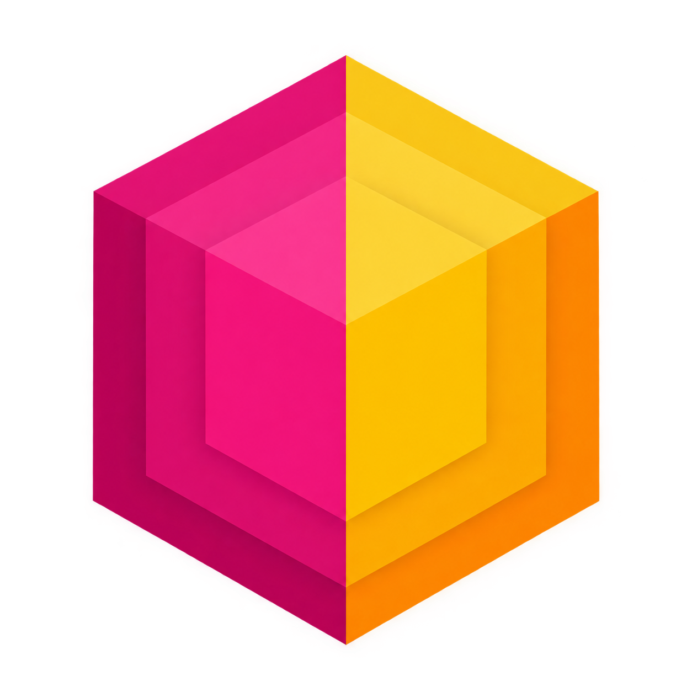

<div align="center">
  <br>
  
  <h1>Facet</h1>
  <p><strong>Ein minimalistisches Obsidian-System für die Arbeit mit KI-Agenten.</strong></p>
  <p>
    Keine Ordnerhierarchie. Einordnung über Properties.<br>
    Regeln, an die sich auch ein Agent hält.
  </p>
  <p>
    
    
    
  </p>
  <p>
    <a href="#-aufbau">Aufbau</a> &nbsp;·&nbsp;
    <a href="#-einrichtung">Einrichtung</a> &nbsp;·&nbsp;
    <a href="#-mit-einem-ki-agenten-arbeiten">KI-Agenten</a> &nbsp;·&nbsp;
    <a href="#-pflege">Pflege</a>
  </p>
  <br>
</div>

---

Die meisten Wissenssysteme scheitern nicht an zu wenig Struktur, sondern an zu viel. Verschachtelte Ordner, ein Dutzend Konventionen, Pflege, die mehr Zeit kostet als das Schreiben selbst – irgendwann benutzt man es nicht mehr. Facet geht den umgekehrten Weg: so wenig Struktur wie möglich, und die verbleibende so einfach, dass sie sich nebenbei einhalten lässt.

Konkret heißt das: keine Ordnerhierarchie. Jede Notiz liegt flach in `Notes/`, ihre Einordnung steckt im Frontmatter, und Bases bauen daraus die Ansichten, die man sonst mit Ordnern erzwingen müsste. Eine Notiz kann in mehreren Zusammenhängen auftauchen, ohne kopiert oder verschoben zu werden. Braucht man einen neuen Blickwinkel, entsteht eine View – kein neuer Ordner, keine Umsortierung.

Dazu kommen zwei Dateien im Root, die festhalten, wie hier gearbeitet wird und für wen. Sie sind der Grund, warum ein KI-Agent diesen Vault pflegen kann, ohne bei jedem Chat neu erklärt zu bekommen, wo was hingehört und in welcher Form.

> [!NOTE]
> Der Name kommt von der *faceted classification*: Einordnung über mehrere unabhängige Merkmale statt über einen Baum.

## 📁 Aufbau

| Ort | Inhalt |
|---|---|
| 📝 `Notes/` | alle normalen Notizen, flach |
| 📅 `Periodic/` | Daily, Weekly, Monthly, Yearly |
| 🔍 `Bases/` | Ansichten auf die Notizen, je Area und für große Projekte |
| 📐 `Templates/` | Vorlagen für neue Notizen |
| 📎 `Attachments/` | Bilder, PDFs und andere Dateien |
| 🤖 [`AGENTS.md`](AGENTS.md) | die Regeln: Struktur, Frontmatter, Tags, Aufbau, Prüfung |
| 👤 [`USER.md`](USER.md) | Kontext über die Person, für die gearbeitet wird |

## 🚀 Einrichtung

Repo klonen und den Ordner in Obsidian als Vault öffnen.

```bash
   git clone https://github.com/markjnt/facet.git
```

## 🤖 Mit einem KI-Agenten arbeiten

Diesen Satz in System-Prompt, Custom Instructions oder Projekt-Anweisungen des jeweiligen Tools eintragen:

```text
Für alles, was meinen Obsidian-Vault betrifft, verwendest du den Obsidian-MCP-Server – zum Lesen wie zum Schreiben. Lies dort als Erstes `AGENTS.md` im Vault-Root und halte dich an die festgelegten Regeln. Bei Widerspruch zu anderen Notizen gilt AGENTS.md.
```

> [!IMPORTANT]
> **Voraussetzungen**
> - Zugriff auf den Vault über einen Obsidian-MCP-Server, etwa [MCPVault](https://mcpvault.org/) oder [NoteMesh](https://github.com/ChangeNode/notemesh) als Remote MCP
> - Die Skills `obsidian-markdown` und `obsidian-bases` aus [kepano/obsidian-skills](https://github.com/kepano/obsidian-skills)

## 🔧 Pflege

[`AGENTS.md`](AGENTS.md) ist die einzige Stelle für Konventionen. Ändert sich eine Regel, wird sie dort geändert und `Templates/` nachgezogen – nicht umgekehrt.

## 📄 Lizenz

[MIT](LICENSE) © Mark Janitschek
